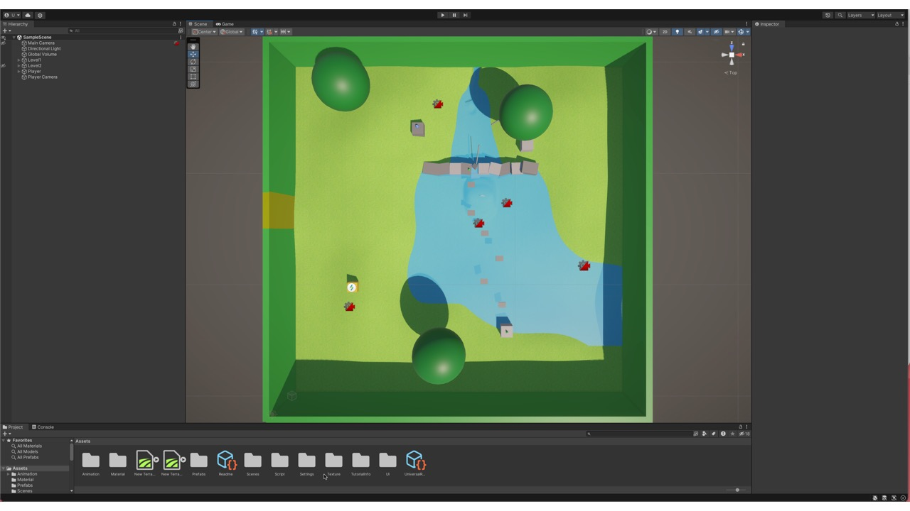
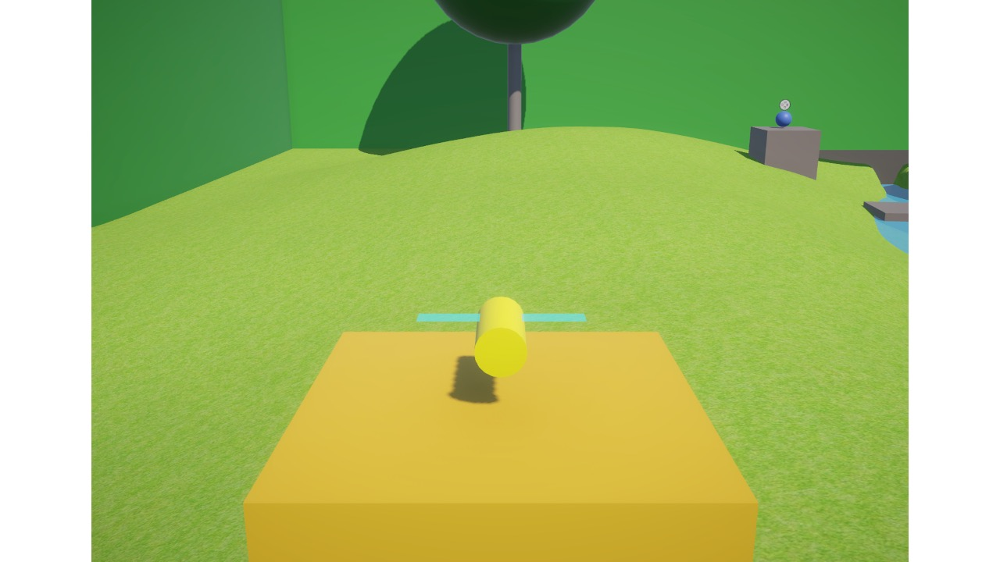
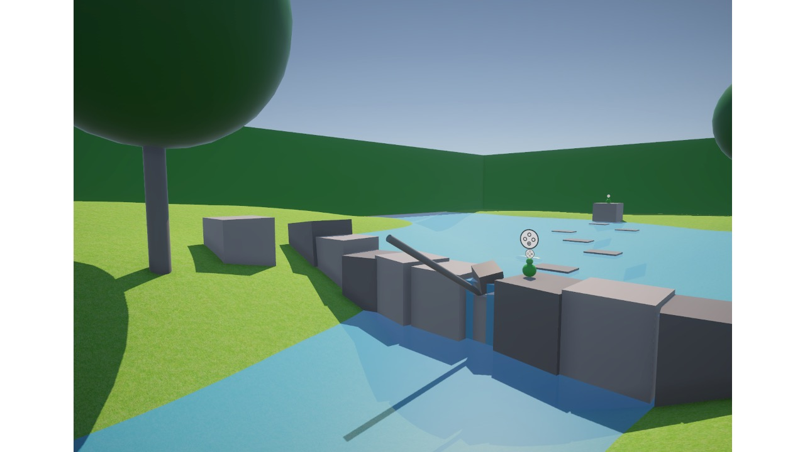
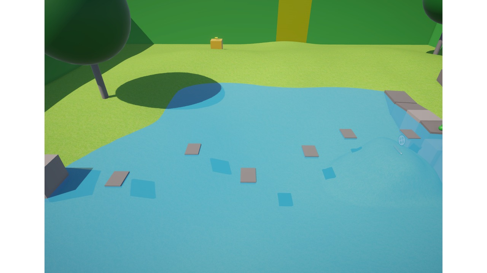
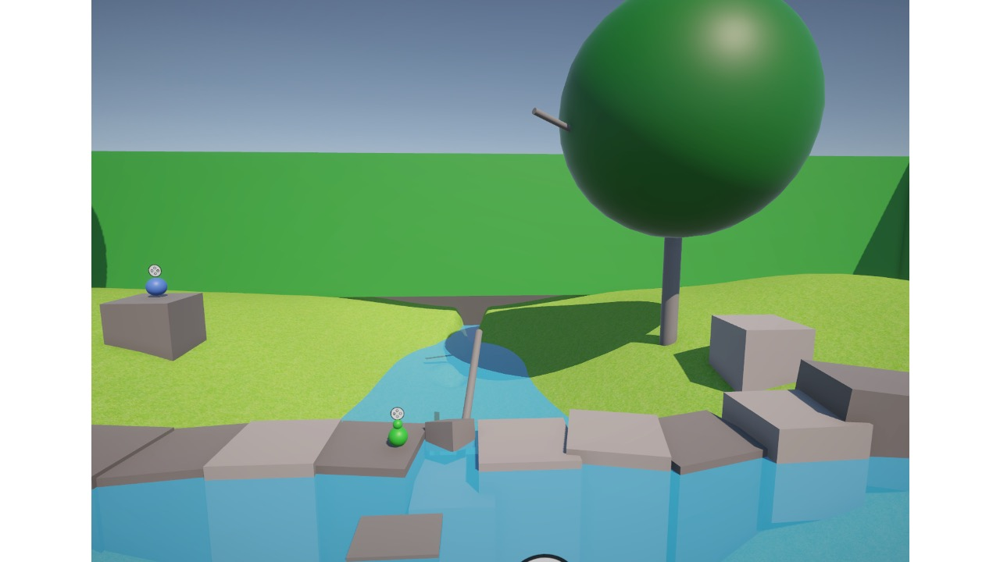

# thebeeaproject
The Beea Project è sia un videogioco che un video-diario in cui vi mostrerò il mio percorso di sviluppo dall'ideazione al rilascio, usando principalmente Unity e Blender.

Canale Youtube
https://www.youtube.com/channel/UC14864r07RfbKCnGzbGv8pg

Playlist The Beea project: https://www.youtube.com/watch?v=4nFS6CA_9pY&list=PLXluEbwqaGXKkJP30wf_Nd2usb5SAUhqc&pp=gAQBiAQB
Playlist "Primi passi con Unity": https://www.youtube.com/watch?v=5UqkoSuJDjs&list=PLXluEbwqaGXIXAuHGvmHCXNIW9lHjKJ3S&pp=gAQBiAQB

## Il prototipo (block world)

Il primo livello (vista dall'alto)

Vista in terza persona (Beeatrice)

Cutscene 1 (La rana e il ramo)

Cutscene 2 (Lo stagno)

Cutscene 3 (Uccello e rana)

